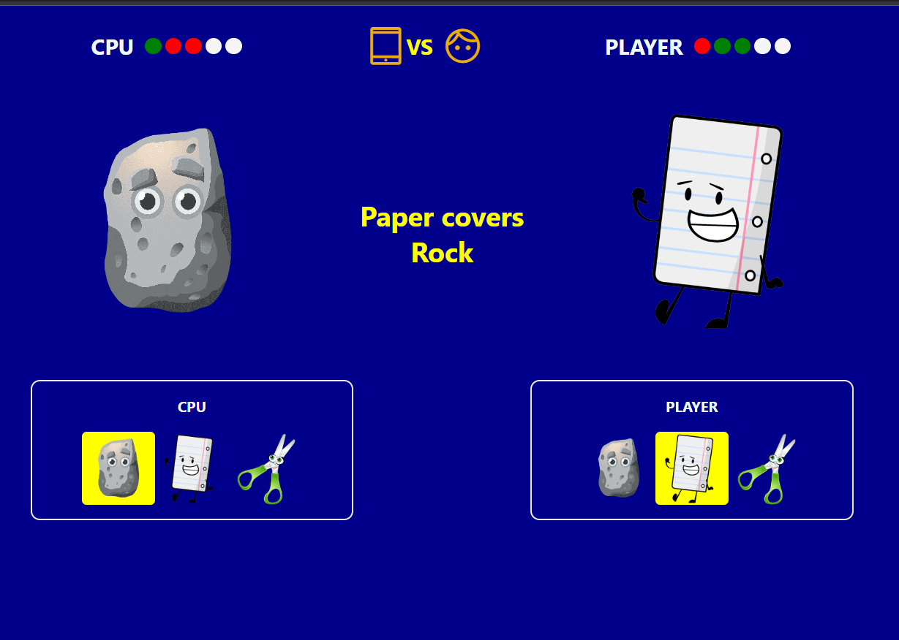

# Simple implementation of Rock Paper Scissors game

## Run on Terminal
<code>google-chrome index.html</code>

## Screenshot

## Rules
Despite its underlying complexity, the game’s rules are straightforward. Players deliver hand signals representing rock, paper, or scissors, with the outcome determined by these three rules:

- Rock wins against scissors.
- Scissors win against paper.
- Paper wins against rock.

## Author
👤 soris2000
